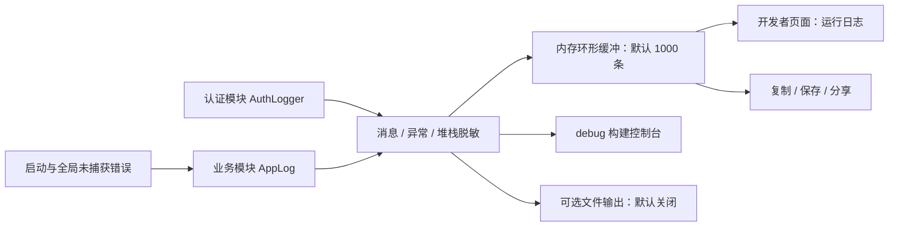

# 运行日志与错误记录

## 记录流程

认证模块使用 [`AuthLogger`](../../lib/utils/auth_logger.dart)，业务模块使用 [`AppLog`](../../lib/utils/app_log.dart)。两者共享同一个缓冲和导出入口，通过 `AuthLogCategory` 区分来源，避免分成两套日志后丢失认证失败与业务请求之间的时间顺序。



一条记录包含时间、分类、级别、模块 tag、操作说明，以及可选的异常详情和堆栈。认证日志的分类是 `authentication`；业务和运行错误的分类是 `business`。分类与级别独立，认证失败仍属于认证日志。

启动前使用 `AppLog.bootstrapLogger`，DI 注册时沿用同一实例。业务门面每次取当前注册实例，避免测试或重新装配后日志写入旧对象。

## 错误记录约定

- 捕获真实异常时记录 `ERROR`，同时传入 `error` 和 `stackTrace`，再保持原来的状态更新、回退或异常传播行为。
- 返回失败状态、HTTP 错误、图片加载失败、平台回调失败等没有 Dart 异常的路径也必须记录。不能只用 `debugPrint` 或设置错误文案。
- 无本地 `catch` 的异步操作可以用 `AppLog.guard`；认证操作可以用 `AuthLogger.guard`。它们记录后重抛原异常，不增加业务重试。
- 公共 API 包装记录最终失败，首次会话失效后成功恢复可以记录 `WARN`。第二课堂仍仅针对明确的认证过期重试，避免重复提交报名等操作。
- 用户取消下载、关闭验证码或系统选择器、不支持的平台，以及解析器尝试兼容格式的正常分支不视为操作失败。兼容后仍不能完成操作时应记录最终错误。
- [`AppErrorHandlers`](../../lib/utils/app_error_handlers.dart) 记录 Flutter 框架错误和根 isolate 未捕获异步错误，保留此前的错误处理器。本地错误记录仍负责补充功能和操作上下文。

```dart
try {
  await loadData();
} catch (error, stackTrace) {
  AppLog.e('GradesProvider', '加载成绩失败',
    error: error, stackTrace: stackTrace);
  // 保持原有错误状态、提示或重抛逻辑。
}
```

记录覆盖查询及缓存（成绩、培养方案、修读情况、考试、教室、课表、体测、网络设备、用户信息、研究生服务）、第二课堂、办事大厅、缴费余额、报修、课表编辑及导入导出、校历和节假日、通知 WebView 及附件下载、小组件、更新、背景图片及主题色、图标、桌面窗口、存储清理和开发者工具。一个错误在 API 与界面边界可以留下不同上下文的记录，不保证每个异常恰好一条。

## 查看与导出

开发者页面的“运行日志”提供“全部”“认证日志”“业务错误”三个视图。业务错误视图显示 `business` 分类下的 `WARN` 和 `ERROR`，并可继续按级别与 tag 筛选。堆栈可展开查看，tag 列表随缓冲实时更新。

复制、保存和分享导出整个缓冲，保留关联上下文。文件名和目录沿用 `bugaoshan-auth-{timestamp}.log` 与 `Bugaoshan/auth_logs/`，内容已包含两种分类。导出默认到临时/外部缓存目录；可选连续输出写入应用文档目录的 `auth.log`。文件输出失败会关闭该输出并保留内存错误记录，不阻塞业务。

日志默认只在当前进程内保留，超出容量时淘汰旧记录；清空、进程退出和系统清理缓存会影响可追溯窗口。Dart 的全局处理器不接管原生进程崩溃或被操作系统终止的情况。

## 隐私

消息、异常与堆栈在存储前统一脱敏，包括 token、重置凭据、密码、Bearer、OAuth 参数和账号标识。`FormatException` 仅保留 message 与 offset，不输出可能含个人信息的原始 source。

不主动写入凭据、完整表单、原始个人数据或响应正文。办事大厅记录字段数量、数据类型和响应长度；异常仍保留可诊断的原因与堆栈。脱敏规则不能代替调用方对日志内容的选择。
